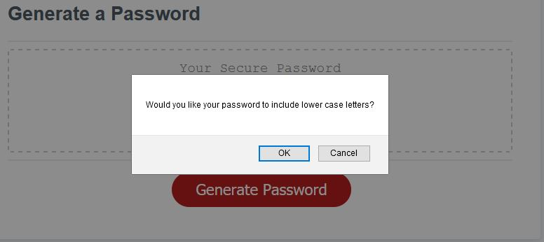
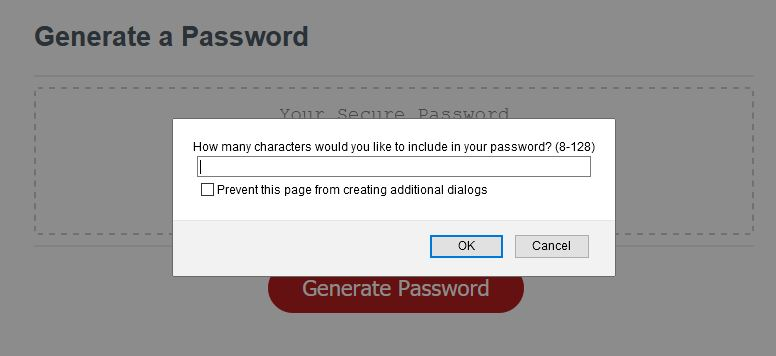
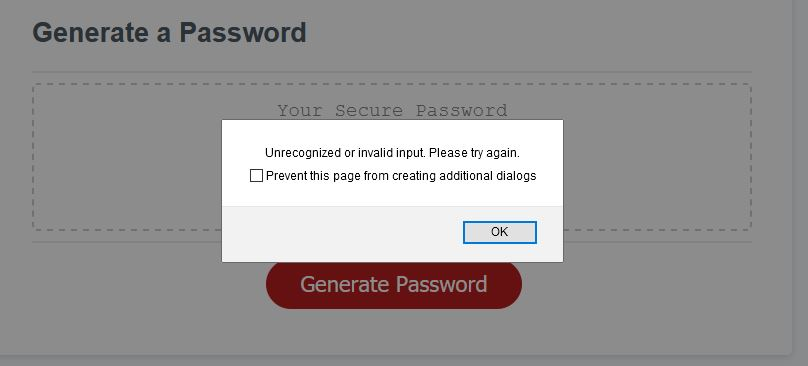
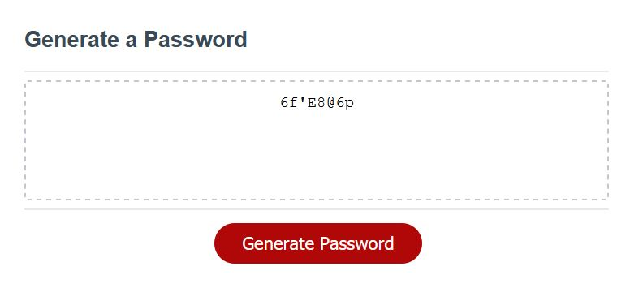
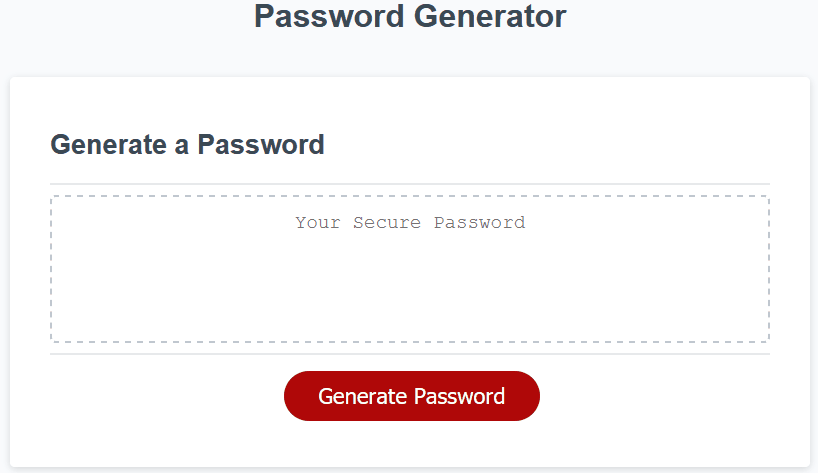

# hw-02-javascript
A password generator

Description: This assignment was a test of our ability to create and script logic using
the programming language javascript. The HTML/webpage and CSS/style code was created for us,
and we had to write the javascript code enabling a password generator to work.

The password generator prompts the user, after pressing a button, to select the types
of characters to be included in the password and the length of the password, after which
a password with at least on of each character type selected and of matching length is displayed
on the screen. Here are some screen shots of some of the prompts and the result:

Here is an example of one of the character type prompts:

Here is the user being prompted to enter the length of the password, as a number:

What happens when the user enters invalid data:

Finally, the user is rewarded with a password with the proper length, and at least one of every 
type of character chosen:

Here is a gif of the full process!

To make this work, I needed to create several functions that worked together to accept input, verify
the input, then use the input to create and verify the password before displaying it. Here is some
essential code examples of what was written:

This is the generatePassword function, which is whats being called to create and return the password
to be displayed by the webpage:

And here is the code for the function that accepts and checks the users input for
password length:
